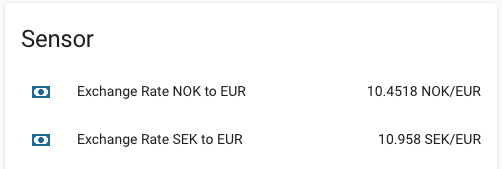

# Currency Exchange Rate integration for Home Assistant
This custom component retrieves currency exchange rates from the European Central Bank (ECB) and makes them available as a sensor in Home Assistant. ECB provides daily reference exchange rates via an free API. The rates gets updated around 16.00 CET every working day ([more info here](https://www.ecb.europa.eu/stats/policy_and_exchange_rates/euro_reference_exchange_rates/html/index.en.html)).

## Features
The integration gives the latest currency exchange rate between the specified currencies and the Euro (EUR). The exchange rate will be updated at midnight every day and the latest available exchange rate will be used.



## Installing the integration
Copy the `ecb_exr` folder into your `config/custom-components` folder in you Home Assistant.

## Cofiguration
Enable the integration by adding `ecb_exr:` to your `configuration.yaml` and list the currencies for which you want the exchange rate to Euro (EUR).

```yaml
ecb_exr:
    currencies:
      - SEK
      - NOK
```

Add the following to your `configuration.yaml` under `sensor:`. This will create one sensor for each currency specified above.
```yaml
sensor:
 - platform: ecb_exr
 ```
